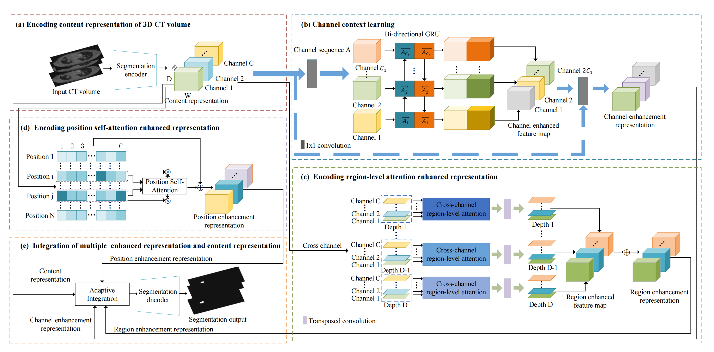
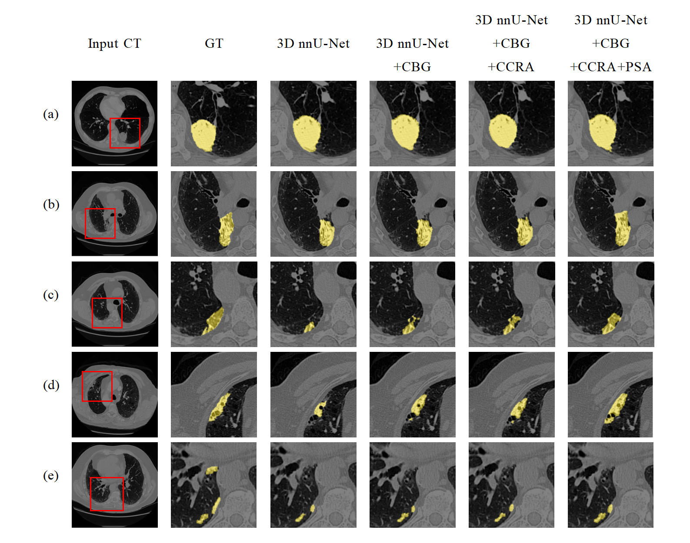
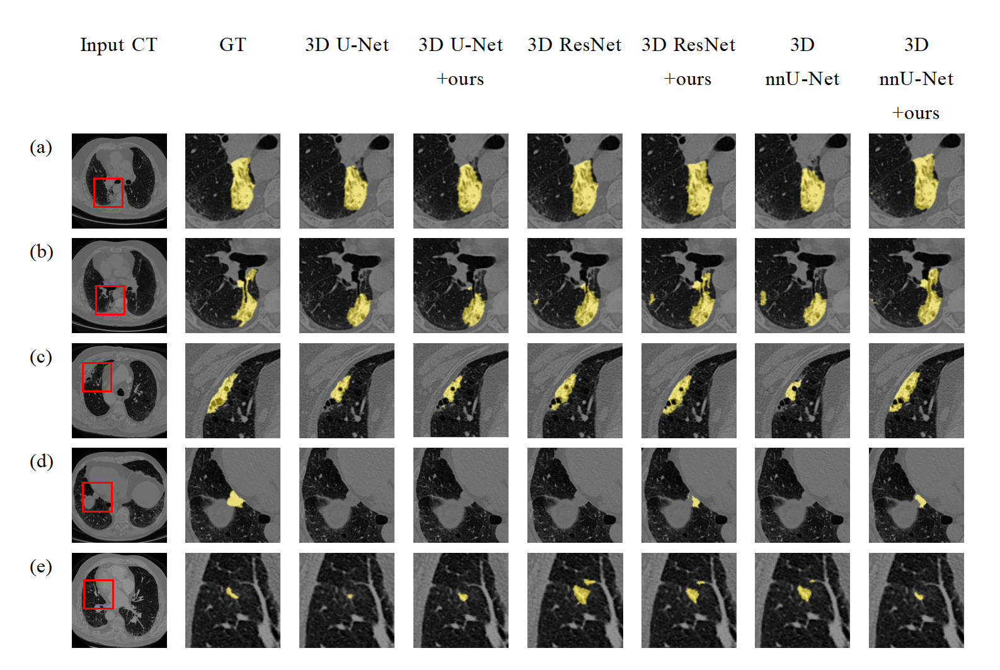
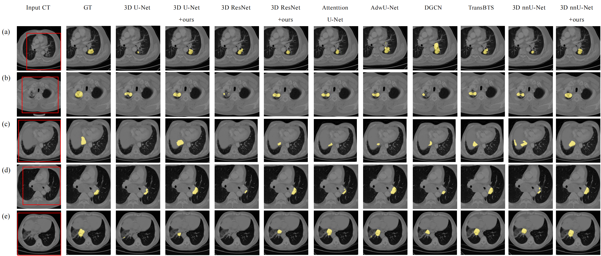

# CMPB: Convolutional bi-directional learning and spatial enhanced attentions for lung tumor segmentation
Built upon [MIC-DKFZ/nnUNet](https://github.com/MIC-DKFZ/nnUNet), this repository provides the official PyTorch implementation of CMPB.

## How to use CMPB:
### 1. Requirements:
Linux, Python3.7+, Pytorch1.6+
### 2. Installation:
* Install nnU-Net as below
git clone https://github.com/MIC-DKFZ/nnUNet.git
cd nnUNet
pip install -e .
* Copy the python files in folder gru to nnunet
* Copy the python files in folder attention to nnunet
* Copy the python files in folder network_architecture to nnunet/network_architecture

### Example results  

- Framework of the proposed PRCS model.


- Lung tumor segmentation results by baseline 3D nnU-Net, 3D nnU-Net with convolutional bi-directional GRU (3D nnU-Net+CBG), 3D nnU-Net with convolutional bidirectional GRU and cross-channel region-level attention (3D nnU-Net+CBG+CCRA), and our final model using CBG, CCRA, and PSA (3D nnU-Net+ours). Lung tumors in the images are marked in yellow.
- 

- Segmentation cases of PRCS models (ours) embedded into 3D U-Net, 3D ResNet, and 3D nnU-Net. Yellow indicates the segmented lung tumor region..
- 

- Five cases with manual delineation results (GT) and the segmentation results by our model and
other comparing models on the SDCH dataset. The lung tumor segmented by each model are shown in
yellow color.

### Dataset
[MSD](http://medicaldecathlon.com/),[SDCH](a dataset from Shandong Cancer Hospital)

## Citation
If you find this repository useful, please consider citing our paper:
```
@inproceedings{
xuan2022cmpb,
title={Convolutional bi-directional learning and spatial enhanced attentions for lung tumor segmentation},
author={Ping Xuan and Bin Jiang and Hui Cui and Qiangguo Jin and Peng Cheng and Toshiya Nakaguchi and Tiangang Zhang and Changyang Li and Zhiyu Ning and Menghan Guo and Linlin Wang},
booktitle={Computer Methods and Programs in Biomedicine(under review)},
year={2022}
}
```
